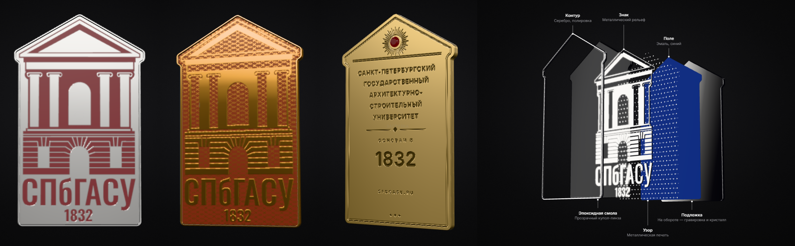

# Эмблема СПбГАСУ · интерактивная 3D-страница

**Открыть:** https://nakarandashe27.github.io/3D-LOGO-SPBGASU/



Эмблема Санкт-Петербургского государственного архитектурно-строительного университета в виде
настоящего изделия: металл, горячая эмаль в перегородках, купол эпоксидной смолы, а на обороте
гравировка полного названия и кристалл. Эмблему можно крутить, переворачивать, разбирать по слоям
и настраивать.

Сделано на [Three.js](https://threejs.org) + [Vite](https://vite.dev). Геометрия строится прямо в
браузере из векторного логотипа с сайта университета, поэтому внешние 3D-файлы не нужны. Окружение
студии тоже процедурное. После сборки страница не обращается ни к каким CDN и работает офлайн.

## Запуск

```bash
npm install
npm run dev        # http://localhost:5173
npm run build      # готовая статика в папке dist/
npm run preview    # посмотреть собранную версию
```

## Деплой

Сайт публикуется на **GitHub Pages автоматически**: каждый push в `main` запускает
[workflow](.github/workflows/deploy.yml), который собирает проект и выкладывает `dist/`.
Один раз в настройках репозитория нужно выбрать *Settings → Pages → Source: GitHub Actions*.

Папка `dist/` — обычная статика с относительными путями, поэтому её можно выложить и в другое место:
**Netlify Drop** (перетащить `dist` на https://app.netlify.com/drop) или **Vercel** (`npx vercel`).

## Как показать на презентации

1. **Живая страница.** Откройте ссылку и нажмите **P**: панель скроется, включится полный экран.
   Esc выходит из полноэкранного режима, **H** возвращает панель.
2. **Внутри PowerPoint.** Надстройка *Web Viewer* (Вставка → Надстройки) показывает живую страницу
   прямо на слайде.
3. **Как 3D-объект PowerPoint.** Экспорт → «3D · GLB», затем в PowerPoint *Вставка → 3D-модели → Из файла*.
   Модель можно вращать прямо на слайде, и интернет для этого не нужен.
4. **Подстраховка без интернета.** Экспорт → «Видео 360°» (MP4) или «PNG» с прозрачным фоном.

Ссылка запоминает настройки: кнопка «Ссылка» копирует адрес вида
`…/#metal=gold&style=relief&pattern=guilloche`. Параметр `ui=0` открывает страницу сразу без панели,
это удобно для встраивания: `…/#ui=0&autoRotate=1`.

## Управление

| Действие | Мышь / тач | Клавиша |
|---|---|---|
| Повернуть | потянуть | — |
| Перевернуть / подбросить | клик по эмблеме | Пробел |
| Приблизить | колесо / щипок | — |
| Собран ⇄ По слоям | — | L |
| Автоповорот | — | R |
| Скрыть/показать панель | — | H |
| Полный экран | — | F |
| Режим презентации | — | P |

## Что настраивается

- **Вид:** собран / по слоям (с выносками: контур, смола, знак, узор, поле/перегородки, подложка).
- **Взаимодействие:** «Вращение» (клик переворачивает) или «Монетка» (клик подбрасывает).
- **Форма:** «Силуэт» (фронтон со свесом карниза, как фасад) или «Пластина» (табличка).
- **Знак:** «Эмаль» — фирменный бордо в металлических перегородках (клуазоне);
  «Рельеф» — полированный металлический знак на эмалевом поле.
- **Металл:** золото, розовое золото, медь, серебро, титан, чёрный никель; полировка, сатин, мат.
- **Эмаль, узор** (штриховка из исторического логотипа, кладка, чертёж, гильош, точки, звёзды),
  **смола, кристалл** (рубин, сапфир, бриллиант), **свет и фон**.

## Структура

```
src/
  assets/emblem.js  контуры эмблемы (извлечены из sprite.svg сайта spbgasu.ru, #logo-new)
  emblem.js         SVG → булевы операции (Clipper) → слои 3D-объекта
  materials.js      металлы, эмаль, смола, кристалл
  environment.js    процедурная фотостудия для отражений
  patterns.js       бесшовные узоры
  engraving.js      гравировка оборота
  labels.js         выноски режима «По слоям»
  export.js         PNG, GLB, видео 360°
  ui.js, style.css  панель настроек
  main.js           сцена, ввод, анимации, состояние
references/         исходные SVG логотипа (новый и исторический)
```

## Лицензия

Код распространяется по лицензии MIT (см. [LICENSE](LICENSE)). Логотип и название СПбГАСУ
принадлежат университету, и лицензия MIT на них не распространяется. Вектор логотипа взят с
официального сайта https://www.spbgasu.ru/.
